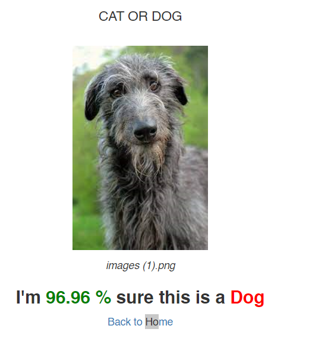

# dog-vs-cat
Image classification refers to the tasks of extracting information classes from a multiband raster image.
depending on the interaction between the analyst and the computer during classification, there are two types of classification: supervised and unsupervised.
We will be working with supervised image classification.

## Details of the project
The project is divided into three parts:
1. Using mobilenets for image classification.
2. building our own model for image classification.
3. build a web app with flask to mount the prediction model.
4. we deploy the flask project on heroku through github.

